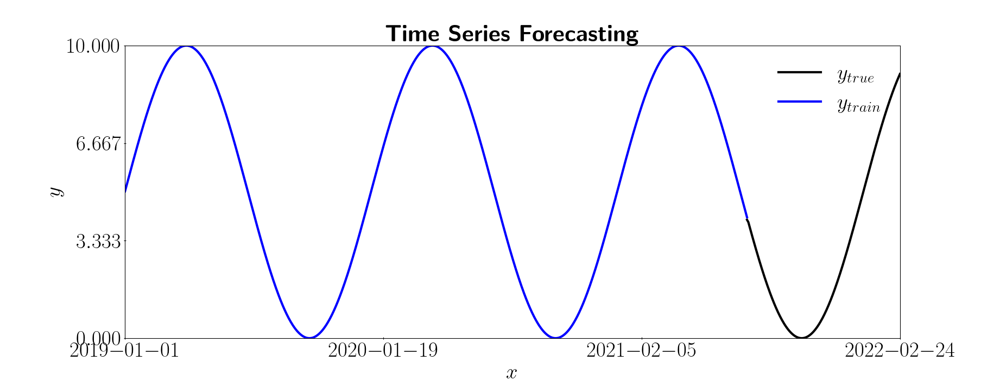
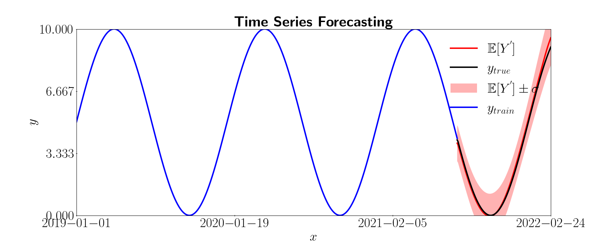

# Toy time series problem 

**Author:** [Miquel Florensa](https://www.linkedin.com/in/miquel-florensa/)  
**Date:** 2023/05/25  
**Description:** This example shows how to use the time series forecaster to solve a LSTM toy problem.  

<a href="https://github.com/miquelflorensa/cuTAGI/blob/main/python_examples/time_series_runner.py" class="github-link">
  <div class="github-icon-container">
    
  </div>
  <div class="github-text-container">
    Github Source code
  </div>
</a>

---

## 1. Setup

```python
from visualizer import PredictionViz

from python_examples.data_loader import TimeSeriesDataloader
from python_examples.model import TimeSeriesLSTM
from python_examples.time_series_forecaster import TimeSeriesForecaster
from pytagi  import load_param_from_files
```

?>Notice that this modules are described [here](modules/modules.md) and the source code is in the *python_examples* directory, in case you have the modules in another directory you must change this paths.

## 2. Prepare the data

In this simple example we will use a toy dataset. The data is generated from a sinus function. The goal is to learn to predict the following timesteps knowing the previous ones.

```python
# User-input
num_epochs = 50       # row for 50 epochs
output_col = [0]      # column to predict
num_features = 1      # number of features
input_seq_len = 5     # input sequence length
output_seq_len = 1    # output sequence length
seq_stride = 1        # stride between input sequences
x_train_file =        "./data/toy_time_series/x_train_sin_data.csv"
datetime_train_file = "./data/toy_time_series/train_sin_datetime.csv"
x_test_file =         "./data/toy_time_series/x_test_sin_data.csv"
datetime_test_file =  "./data/toy_time_series/test_sin_datetime.csv"
```

**You can find the used data in the [toy time series data](https://github.com/lhnguyen102/cuTAGI/tree/main/data/toy_time_series) in the repository.*

?>We can plot the training data points and the trend line we want to learn.



## 3. Create the model

We will use a with a simple LSTM architecture as defined in the TimeSeriesLSTM class wich is suited for Time Series Forecasting. Find out more about the [TimeSeriesLSTM class](modules/models?id=lstm-for-time-series-forecasting).

```python
# Model
net_prop = TimeSeriesLSTM(input_seq_len=input_seq_len,
                          output_seq_len=output_seq_len,
                          seq_stride=seq_stride)
```

> If you want to use a different model, you can create your own class and make sure that it inherits from the NetProp class, more information in [models page](modules/models?id=netprop-class).

## 4. Load the data

We will make use of the [TimeSeriesDataloader](modules/data-loader?id=data-loader) class to load and process the data. The *process_data* function requires the input and output test and training files in a **csv** format.

```python
# Data loader
ts_data_loader = TimeSeriesDataloader(batch_size=net_prop.batch_size,
                                      output_col=output_col,
                                      input_seq_len=input_seq_len,
                                      output_seq_len=output_seq_len,
                                      num_features=num_features,
                                      stride=seq_stride)
data_loader = ts_data_loader.process_data(
    x_train_file=x_train_file,
    datetime_train_file=datetime_train_file,
    x_test_file=x_test_file,
    datetime_test_file=datetime_test_file)
```

## 5. Create visualizer

In order to visualize the predictions of the regression we can use the PredictionViz class. This class will create a window with the true function, the predicted function and the confidence intervals.

```python
# Visualzier
viz = PredictionViz(task_name="forecasting", data_name="sin_signal")
```

> Learn more about PredictionViz class [here](https://github.com/lhnguyen102/cuTAGI/blob/main/visualizer.py).

## 6. Train and evaluate the model

Using the [TimeSeriesForecaster class](modules/time-series-forecaster.md) that makes use of TAGI, we will train and test the model. When doing the prediction we can specify the standard deviation factor to calculate the confidence intervals.

```python
# Train and test
ts_task = TimeSeriesForecaster(num_epochs=num_epochs,
                                data_loader=data_loader,
                                net_prop=net_prop,
                                viz=viz)

ts_task.train()
ts_task.predict()
```

## 7. Visualize the results

At the end of the execution the results will be printed in the console as seen below.

> MSE           :  0.03  
> Log-likelihood: -1.11

?> If you have created the visualizarion object and passed it to the regression object, a new window will pop up with the results.



**The black line is the true function, the red line is the predicted function and the red zone is the confidence intervals.*
